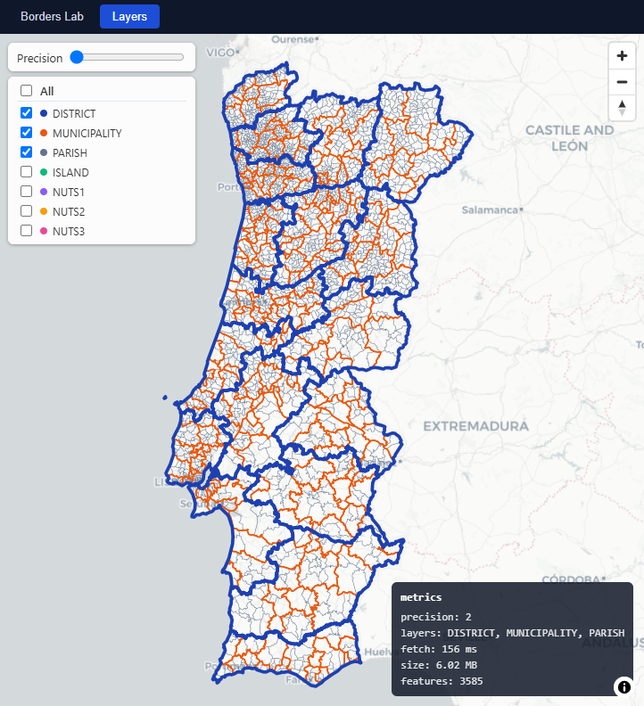
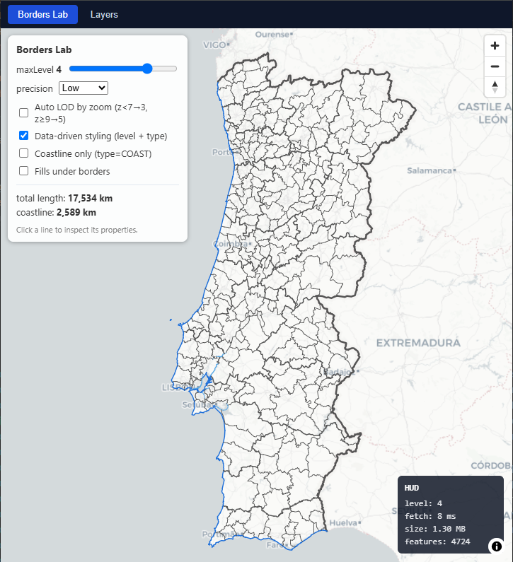

# terrapi-api

A ready-to-run REST API that imports Portugal's official administrative maps ([CAOP 2025](https://www.dgterritorio.gov.pt/cartografia/cartografia-oficial/caop)), preprocesses the geometry, and serves it as fast, cached GeoJSON — so you don't have to deal with raw GeoPackage files, coordinate transforms, or polygon simplification yourself.

**Built for solo devs and small teams** who want an interactive map of Portugal's districts, municipalities, and parishes without depending on third-party services.

---

## What problem does it solve?

If you're building a map-based app that covers Portugal, you need administrative boundaries. The official source is the [CAOP dataset](https://www.dgterritorio.gov.pt/cartografia/cartografia-oficial/caop) (published by [DGT](https://www.dgterritorio.gov.pt/) under [CC BY 4.0](https://creativecommons.org/licenses/by/4.0/)). But raw CAOP is distributed as four large GeoPackage files — complex multipolygons, inconsistent coordinate systems, thousands of vertices per shape. Turning that into something a browser can render smoothly takes work.

**terrapi-api does that work once and serves it over HTTP.** You get:

- Simplified, cached **polygons at multiple detail levels** — from coarse outlines for a country-wide map down to full-detail boundaries for a single parish
- A full **administrative hierarchy** (district → municipality → parish, plus NUTS statistical regions and the Madeira/Azores islands)
- A **classified border-line network** — every shared boundary edge tagged with its level and type (land/coast/water), ready to style with thick national borders and thin parish lines
- **Spatial queries** — click on a map and find out which parish you're in, list everything inside a bounding box, search by radius
- Everything served as **standard GeoJSON** that any mapping library understands (Leaflet, MapLibre, Mapbox, OpenLayers, Google Maps)

---

## How it works

```
  CAOP .gpkg files                 terrapi-api                     Your app
 ┌──────────────────┐      ┌───────────────────────┐      ┌──────────────────┐
 │ Continente       │      │                       │      │                  │
 │ Madeira          │────▶│ Import → Preprocess →  │────▶│  GET /layers/    │
 │ Azores W         │      │ Simplify → Classify   │      │  GET /geo/       │
 │ Azores C+E       │      │ Cache → Serve         │      │  GET /borders/   │
 └──────────────────┘      └───────────────────────┘      └──────────────────┘
```

1. **Import** — Feed it the 4 CAOP GeoPackage files (either from disk or upload them via the API). It reads the raw polygon data and builds the full hierarchy — connecting each parish to its municipality, each municipality to its district, and linking NUTS statistical codes throughout.

2. **Preprocess** — The geometry gets projected into a metre-based system for accurate simplification, then simplified at multiple detail levels using PostGIS `ST_CoverageSimplify`. This means neighbouring units keep perfectly matching borders even after simplification — no gaps, no overlaps. Border arcs are classified and line-simplified independently.

3. **Serve** — Whole layers (all districts, all municipalities, etc.) are cached in memory with ETags. Pick a unit on the map, and fetch its precise boundary on demand. The two-tier approach means your map loads fast but still shows full detail when the user zooms in on something.

---

## Quick start

### What you need

- [Java 25](https://adoptium.net/) (or newer)
- [Docker](https://www.docker.com/) (runs the database)
- The 4 CAOP 2025 GPKG files — download them from [DGT](https://www.dgterritorio.gov.pt/cartografia/cartografia-oficial/caop)

### 1. Start the database

```bash
docker compose up -d
```

A PostGIS container starts on port `5445`. Everything is pre-configured — database name, user, password.

### 2. Build and run

```bash
./mvnw clean package -DskipTests
java -jar application/target/application-0.0.1-SNAPSHOT.jar
```

The API is now running at **http://localhost:8081**. Swagger UI at **http://localhost:8081/swagger-ui/index.html** — explore all endpoints interactively.

### 3. Import the CAOP data

Upload all 4 GPKG files in a single request:

```bash
curl -X POST "http://localhost:8081/api/v1/import/caop/upload" \
  -F "files=@Continente_CAOP2025.gpkg" \
  -F "files=@ArqMadeira_CAOP2025.gpkg" \
  -F "files=@ArqAcores_GOcidental_CAOP2025.gpkg" \
  -F "files=@ArqAcores_GCentral_GOriental_CAOP2025.gpkg"
```

All 4 files must be uploaded together — the import is a full rebuild that merges entities split across files (e.g. the Azores NUTS). There's also a dev-only endpoint `POST /api/v1/import/caop/{folder}` that reads `.gpkg` files from a server-side directory path, useful when running inside an IDE with local files — but the upload endpoint above is what you'd use against a deployed instance.

### 4. Generate simplified geometries

```bash
curl -X POST "http://localhost:8081/api/v1/precision/generate"
```

This creates simplified versions at 5 detail levels (LOD 0–4) for every unit type. Takes a minute or two.

### 5. Try it out

```bash
curl "http://localhost:8081/api/v1/layers/DISTRICT?lod=2"
```

Returns all 18 mainland districts plus islands as a single GeoJSON FeatureCollection. Drop it into [geojson.io](https://geojson.io) and you'll see Portugal outlined.

### What it looks like



*Simplified district and municipality polygons served by `/api/v1/layers`*



*Classified border line network from `/api/v1/borders` — level (national through parish) and line type (land, coast, water)*

---

## API at a glance

The full API is documented and interactive at `/swagger-ui/index.html`. Here's what's available:

| What you want to do | Endpoint |
|---------------------|----------|
| Get all polygons of a type (e.g. all districts) | `GET /api/v1/layers/{type}?lod=2` |
| Get boundaries as styled lines | `GET /api/v1/borders?maxLevel=3&lod=2` |
| Click a point, find which parish it's in | `GET /api/v1/geo/reverse-geocode?lat=...&lon=...` |
| Get one unit's precise boundary | `GET /api/v1/geo/{code}/geometry` |
| Find what's visible in the current map viewport | `GET /api/v1/geo/within-bbox?minLon=...&maxLon=...` |
| Find nearby units around a point | `GET /api/v1/geo/within?lat=...&lon=...&radiusKm=...` |
| Look up a unit by code | `GET /api/v1/geo-units/{code}` |
| Get a unit's children, parent, neighbours | `GET /api/v1/geo-units/{code}/children` |
| Check if a point is inside a specific unit | `GET /api/v1/geo/contains?code=...&lat=...&lon=...` |

Everything returns GeoJSON. Layers and borders are ETag-cached (24-hour immutable) so repeated requests are instant.

---

## Data details

The API covers all of Portugal — mainland, Madeira, and the Azores — with 3 hierarchy flavours:

| Type | Units | Example |
|------|-------|---------|
| **District** | 18 mainland + 11 islands | Aveiro, Ilha da Madeira |
| **Municipality** | 308 | Lisboa, Funchal |
| **Parish** | 3,249 | Santa Maria Maior, Sé |
| **NUTS 1** | 1 (national) | Continente + Regiões Autónomas |
| **NUTS 2** | 10 | Norte, Algarve, R.A. Madeira |
| **NUTS 3** | 27 | Área Metropolitana do Porto |

Each unit carries area in hectares, perimeter in km, representative coordinates, and parent/children links. NUTS statistical codes are threaded through every level. Islands in Madeira and the Azores sit under autonomous regions with the same parent-child structure as districts.

### Data source and license

Geometry data comes from **CAOP 2025** (Carta Administrativa Oficial de Portugal), published by [Direção-Geral do Território](https://www.dgterritorio.gov.pt/), licensed under [CC BY 4.0](https://creativecommons.org/licenses/by/4.0/). Attribution is required when you use the data served through this API.

For detailed schema info, row counts per region, and code conventions, see:

- [docs/caop-gpkg-overview.md](docs/caop-gpkg-overview.md)
- [docs/gpkg-table-columns.md](docs/gpkg-table-columns.md)

---

## Why run it yourself?

- **Zero third-party dependency at runtime** — the data lives in your own PostGIS database, the API runs on your own machine or server
- **Modify it** — need a different simplification tolerance? Want to add a new endpoint? The code is plain Spring Boot, not a black box
- **Offline capable** — once imported, no external API calls. Works on an air-gapped server
- **One language, one ecosystem** — if your team already knows Java/Spring, there's nothing new to learn

---

## Configuration

| Variable | Default | What it does |
|----------|---------|--------------|
| `SERVER_PORT` | `8081` | Port the API listens on |
| `DB_URL` | `jdbc:postgresql://localhost:5445/terrapi_geo` | Database connection |
| `DB_USERNAME` | `terrapi` | Database user |
| `DB_PASSWORD` | `terrapi` | Database password |
| `CORS_ALLOWED_ORIGINS` | `http://localhost:3000` | Frontend URLs allowed to call the API |

Two profiles are available:

- **`dev`** (default) — Swagger UI enabled, CORS allows localhost:3000
- **`prod`** — Swagger disabled, CORS restricted to `CORS_ALLOWED_ORIGINS`. Activate with `SPRING_PROFILES_ACTIVE=prod`

See [application.yaml](application/src/main/resources/application.yaml) for precision tuning (LOD tolerances, validation thresholds).

---

## Project layout

```
├── core/          JPA entities, DTOs, repositories, DB migrations
├── web/           REST controllers, query services, caching
├── pipeline/      GPKG import, precision generation, derivation
└── application/   Spring Boot entry point + config
```

## Tech

Java 25, Spring Boot 4.0.7, Maven (multi-module), PostgreSQL + PostGIS (Docker), Hibernate Spatial, Flyway, Caffeine, SpringDoc OpenAPI.

## Deeper dives

- [docs/precision-lod-design.md](docs/precision-lod-design.md) — how the multi-level simplification works, topology guarantees, per-type tolerance tables
- [docs/caop-gpkg-overview.md](docs/caop-gpkg-overview.md) — CAOP file inventory, row counts, code conventions
- [docs/gpkg-table-columns.md](docs/gpkg-table-columns.md) — full column schemas of imported tables
